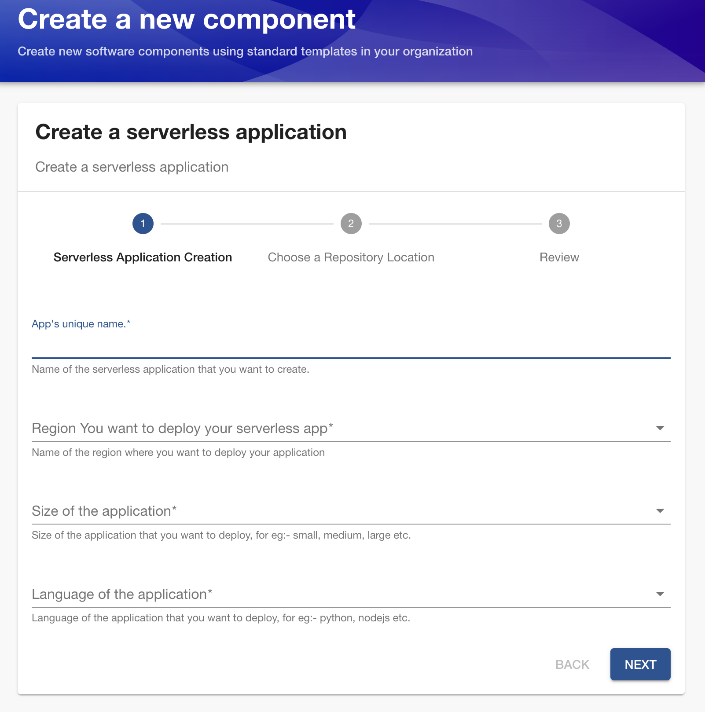

# crossplane-repo


## crossplane 介绍
基于 k8s api 体系的 IaC （Infrastructure as Code）工具。crossplane 的核心为 provider，由 crd 和 controller 两部分组成。以 aws provider 为例，crd 代表 aws resource，controller 根据 用户创建的crd资源 调用 aws service api 创建资源，并且定期 reconcile 确保用户基于 crd 定义的资源，和云端 aws resource 保持一致。所有由 crossplane 创建的资源的 metadata 信息，保留在 k8s etcd 中。


### crossplane 核心概念
crossplane的组件主要包括如下部分, 从下到上分别为


|     |     | 
|--------|--------|
| Managed Resource (MR)  | 通过调用 crossplane各个 provider 提供的 CRD 来创建资源，不受 namespace 管理  | 
| Composite Resource (XR)  | Composition 具体的实现, 可以简单理解为一组 managed resource，不受 namespace 管理，不应该直接暴露给 app team。Claim 类似在 Composition 层面之上又进行了一层基于 namespace 的控制| 
| Composite Resource Definition（XRD）  | 创建API endpoint，类似于 pod, deployment, nodes等。定义了实现一个XRD，用户需要输入哪些参数, 一个 XRD 背后可以 mapping 不同的 Composition  | 
| Composition  | Composition 定义了 XRD 里面用户输入信息与 Managed Resource 间的 mapping。 |
| Claim (XRC)  | app team 基于 XRD 填写表单，类似于创建一个 pod，deployment。Claim 会创建对应的 Composite Resource  |

具体sample 可参考 `manifests`

### MR, XR, XRC 数据的流转
在IaC 领域，不同的 cloud resource 会存在相互依赖，比如 AWS Security Group 的创建，需要依赖于 VPC 的 id。在 crossplane 中，我们可以通过如下方式解决, managedResource A 的 status 可以作为 CompositeResource 的 status 保存起来，并且被传递到managedResource B 中。在实际应用过程中，还可以使用 go template 来更加灵活的完成这部分逻辑，TODO。


## Backstage 介绍
Backstage 提供了一个可扩展的平台运营工具，用于发现，管理和理解组织内部的软件组成和服务，帮助团队更高效的协作。企业内部 Admin 可以基于预制的 scaffold（脚手架代码）来构建前端模块，扩展平台的功能。比如，Admin 可以构建 Service Template，来提供 Serverless 应用的可视化接口。Developer 只需要在 Backstage 平台填写表单，即可申请到相应资源。资源的创建会结合不同的工具，如 terraform，crossplane 等。



### 组件介绍

这个 Demo 主要使用`Software Template`来创建 Template，并且结合 Backstage的 built-in action，比如github 来实现 Backfill和外部资源的对接。我们以下面的 Backfill Service Template 为例。Template 分为两个部分， `parameters` 和 `steps`。其中 parameters中的每个 parameter 定义了当前表单需要填写的内容，比如用户在第一页填写服务需要部署的 region，第二页填写服务的名称，资源的大小等。steps 则定义了Backstage后端如何针对客户填好的表单进行处理，以下面的例子展开：

1. 将用户传入的内容，映射到后端准备好的 claim 文件中，从而实现客户前端表单输入，和后端 crossplane 对接。
2. 针对生成的 claim 文件进行命名，因为通常运维团队会统一在如 github 上存储开发人员生成的claim，为了避免覆盖，我们需要对表单进行重命名。
3. 发布该claim 文件到 github 上，生成 pull request
4. （TODO）将发布的信息注册在 service catalog 中。

```yaml
apiVersion: scaffolder.backstage.io/v1beta3
kind: Template
metadata:
  name: create-serverless-app
  title: Create a serverless application
  description: Create a serverless application 
  tags: ['recommended']
spec:
  owner: guests
  type: service
  parameters:
    - title: Serverless Application Creation
      required:
         - appName
         - region
         - appSize
         - appLanguage    
      properties:
        appName:
          title: App's unique name.
          type: string
          description: Name of the serverless application that you want to create.
          ui:autofocus: true
          ui:options:
            rows: 5
        region:
          title:  Region You want to deploy your serverless app
          type: string
          description: Name of the region where you want to deploy your application
          enum: 
            - US
            - EU
          # ui:autofocus: true
        appSize:
          title: Size of the application
          type: string
          description: Size of the application that you want to deploy, for eg:- small, medium, large etc.
          enum:
            - small
            - medium
            - large
        appLanguage:
          title: Language of the application
          type: string
          description: Language of the application that you want to deploy, for eg:- python, nodejs etc.
          enum:
            - python
            - nodejs
            - java
  # - title: ... second page
  steps:
# Getting the all the files/details from the template
    - id: fetch-base
      name: Fetching Details from content folder
      action: fetch:template
      input:
        url: ./content  # Location of the content directory where catlog-info.yaml file is present for the template
        values:
          appName: ${{ parameters.appName}}
          region: ${{ parameters.region}}
          appSize: ${{ parameters.appSize}}
          appLanguage: ${{ parameters.appLanguage}}
    - id: renameFiles
      action: fs:rename
      name: rename files
      input: 
        files: 
          - from: Serverless_claim.yaml
            to: ${{ parameters.appName }}_claim.yaml

# Publish the content of the current working directory to our github directory
    - id: publish
      name: Publishing Details
      action: publish:github:pull-request
      input:
        allowedHosts: ['github.com']
        description: This repo is to create a serverless app ${{ parameters.appName }} using backstage.
        repoUrl: github.com?repo=crossplane-repo1&owner=yunfeilu92
        branchName: ${{ parameters.appName }}
        title: ${{ parameters.appName }}
        update: true


# Output links  are displayed to the user after the template execution.
  output:
    links:
      - title: Pull Request Url
        url: ${{ steps['publish'].output.remoteUrl }}

```

## 架构图


## 整体流程解释
1. 在 backstage 中，用户填写的表单会被转换为`claim.yaml`以 github pull request 的形式上传至 github
2. 平台管理人员确认 pr 无误后，merge 进入 mainline
3. argocd 监听 mainline 请求，发现有新的 `claim.yaml`进入后，部署 k8s 资源
4. k8s 资源部署后，AWS 后端服务生成

## crossplane 安装

1. 参考链接的安装方式，使用 helm 安装`https://docs.crossplane.io/latest/software/install/`
2. 创建 providerConfig，这里因为时间关系使用 AKSK 的方式，建议在生产中使用 IRSA
```shell
kubectl create secret \
generic aws-secret \
-n crossplane-system \
--from-file=creds=./aws-credentials.txt
```
```yaml
apiVersion: aws.upbound.io/v1beta1
kind: ProviderConfig
metadata:
  name: default
spec:
  credentials:
    source: Secret
    secretRef:
      namespace: crossplane-system
      name: aws-secret
      key: creds
```
3. 这个 demo 需要创建 API Gateway, Lambda, S3, IAM等资源，所以需要安装对应的 provider
```yaml
apiVersion: pkg.crossplane.io/v1
kind: Provider
metadata:
  name: provider-aws-apigatewayv2
spec:
  package: xpkg.upbound.io/upbound/provider-aws-apigatewayv2:v1.9.0
```
```yaml
apiVersion: pkg.crossplane.io/v1
kind: Provider
metadata:
  name: provider-aws-lambda
spec:
  package: xpkg.upbound.io/upbound/provider-aws-lambda:v1.9.0
```
```yaml
apiVersion: pkg.crossplane.io/v1
kind: Provider
metadata:
  name: provider-aws-s3
spec:
  package: xpkg.upbound.io/upbound/provider-aws-s3:v1.9.0

```
```yaml
apiVersion: pkg.crossplane.io/v1
kind: Provider
metadata:
  name: provider-aws-iam
spec:
  package: xpkg.upbound.io/upbound/provider-aws-iam:v1.9.0
```
4. 检查 provider 是否安装成功
`kubectl get providers`


5. 安装定义的 `xrd`以及`composition.yaml`, 在 repo 根目录下运行
```
kubectl apply -f manifests/serverless/xrd.yaml
kubectl apply -f mainfests/serverless/composition.yaml
```

6. (optional) 这个 demo 中，claim 的生成是通过 Backstage 提交表单来实现的，但是我们也可以快速测试一下直接通过 kubectl 创建 claim
```
kubectl apply -f mainfests/serverless/claim.yaml
kubectl apply -f mainfests/serverless/claim-eu.yaml
```
理论上我们可以在输入指令后，等待片刻直接看到下图。但是因为这个 demo 使用到了 lambda，而 lambda 需要指定具体的 s3 object 作为 code source 才可以创建出资源。虽然在 crossplane 中可以创建 s3 object，但是带来的弊端是k8s的 reconcile 机制会使得任何针对这个文件的修改都会被 overwrite 掉，所以在实际过程中，我们采取了待 s3 bucket 创建好后，手动提交 Object 方式。

> **NOTE** 这里使用到了 croissplane 的特性，区别于传统的 IaC 非常注重 Dependency 的概念，在 crossplane 中，用户无需关注资源的相关性，k8s 的 controller 重试机制，会确保所有资源最终成功创建，即使他们是相互依赖的关系。


### Crossplane 可视化工具Komoplane
Komoplane 提供了可视化方式，方便用户理解 Claim -> Composition Resource -> Managed Resource的关系，例如下图：


komoplane的安装方式： https://github.com/komodorio/komoplane

## Backstage 安装
参考 Backstage 基于 k8s 的安装方式 https://backstage.io/docs/deployment/k8s/
这个 demo 因为是实验性质，所以采用了 standalone的方式部署服务。

```
cd backstage-demo
export GITHUB_TOKEN=<Your own PAT>
export NODE_OPTIONS=--no-node-snapshot
yarn dev run 
```

打开本地浏览器，访问 `http://localhost:3000`


## argocd配置
1. 安装 argo cd https://argo-cd.readthedocs.io/en/stable/getting_started/
2. 配置 argocd default project，确保argocd project 有足够的权限创建 k8s 资源，如 namespace 等。

3. 配置 argocd application
```yaml
project: default
source:
  repoURL: 'https://github.com/yunfeilu92/crossplane-repo1'
  path: .
  targetRevision: main
  directory:
    jsonnet: {}
    exclude: README.md
destination:
  server: 'https://kubernetes.default.svc'
syncPolicy:
  automated: {}
  syncOptions:
    - CreateNamespace=true
```
4. 等待资源同步


